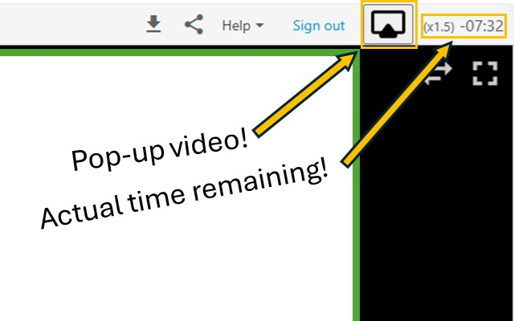

This extension permits HUJI students to view Panopto videos in Picture-in-Picture mode, meaning that any of the video feeds can now be resized and dragged anywhere on the screen (and even to a different one). How I didn't do this before I have no idea. Lots more ideas to follow, like full screen with two feeds.

  <a href="https://chromewebstore.google.com/detail/huji-panopto-tools/bjeajageaomdledjlogdbombjkhpfaap">HUJI Panopto Tools in Chrome Webstore</a>

  

